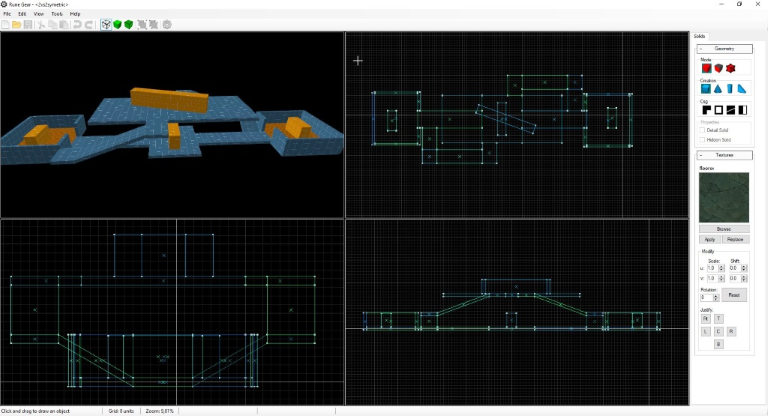

## This project is rather inactive, might I suggest you look at https://trenchbroom.github.io/  

# RunegearX
Migrating the project to .net Core for a 1.0 release.  
* Refactor code
* Add missing basic features
	* CSG carve, slice, hollow
	* Undo/redo of commands
	* Visibility groups (layers)
	* Basic entities
	* Ability to add properties to brushes and entities
	
  

#### Goal
The goal is to 'finish' this project and create a basic oldschool CSG editor with an engine agnostic file format.

#### Core editor features
* Saving/loading file format
* Undo/redo functionality
* Copy, cut, paste brushes/entities
* Texture browser/manager
* Basic configurability through settings
    * colors, etc...
    
#### Core features
* Drawing brush primitives    
    * Rectangle, Cylinder, Wedge, Cone    
* Manipulating brush primitives (brushes, faces, vertices)
    * Move, Rotate, Scale, Skew    
* Texturing brushes
    * Shift, scale, rotate
    * Justify (fit, center, top, left, right, bottom)
    * Lock texture
* Grouping brushes & entities
    * Logical grouping
    * Visibility grouping
* Constructive solid geometry
    * Carve
    * Slice
    * Hollow
    * Extrude
* Place and manipulate entities (basically points with properties)
    * Predefined entities
        * Lights
    * Custom defined entities
